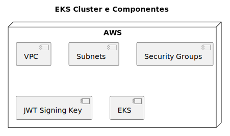

# EKS Cluster IaC

Este projeto é responsável por provisionar um cluster k8s na AWS usando EKS. O cluster é provisionado com uma VPC, sub-redes e grupos de segurança. O cluster também é provisionado com uma classe de armazenamento e alguns complementos.

# Diagrama de Componentes

O diagrama de componentes abaixo representa de forma geral o que está sendo provisionado no projeto:



# Desenvolvimento Local

## Requisitos

- [Terraform](https://www.terraform.io/downloads.html)
- [Terraform Docs](https://github.com/terraform-docs/terraform-docs)
- [AWS CLI](https://aws.amazon.com/cli/)

## Implantação manual

### Atenção

Antes de implantar o cluster, certifique-se de definir as variáveis ​​de ambiente `AWS_ACCESS_KEY_ID` e `AWS_SECRET_ACCESS_KEY`.

Esteja ciente de que esse processo levará alguns minutos (~20 minutos) para ser concluído.

Para implantar o cluster manualmente, execute os seguintes comandos em ordem:

```bash
make init
make check # this will execute fmt, validate and plan
make apply
```

Para destruir o cluster, execute o seguinte comando:

```bash
make destroy
```

## Implantação Automatizada

A implantação automatizada é acionada por uma GitHub Action.

# Provisionamento
<!-- BEGIN_TF_DOCS -->

## Requirements

| Name                                                                      | Version |
| ------------------------------------------------------------------------- | ------- |
| <a name="requirement_terraform"></a> [terraform](#requirement\_terraform) | 1.7.4   |
| <a name="requirement_aws"></a> [aws](#requirement\_aws)                   | 5.38.0  |
## Providers

| Name                                                 | Version |
| ---------------------------------------------------- | ------- |
| <a name="provider_helm"></a> [helm](#provider\_helm) | 2.13.2  |
## Inputs

| Name                                                                              | Description                                         | Type           | Default                                                                   | Required |
| --------------------------------------------------------------------------------- | --------------------------------------------------- | -------------- | ------------------------------------------------------------------------- | :------: |
| <a name="input_azs"></a> [azs](#input\_azs)                                       | The availability zones to use for the VPC           | `list(string)` | <pre>[<br>  "us-east-1a",<br>  "us-east-1b",<br>  "us-east-1c"<br>]</pre> |    no    |
| <a name="input_bucket_name"></a> [bucket\_name](#input\_bucket\_name)             | The name of the S3 bucket to store the tfstate file | `any`          | n/a                                                                       |   yes    |
| <a name="input_cluster_name"></a> [cluster\_name](#input\_cluster\_name)          | The name of the EKS cluster                         | `string`       | `"healthmed"`                                                             |    no    |
| <a name="input_cluster_version"></a> [cluster\_version](#input\_cluster\_version) | The version of Kubernetes to use                    | `string`       | `"1.29"`                                                                  |    no    |
| <a name="input_region"></a> [region](#input\_region)                              | The default region to use for AWS                   | `string`       | `"us-east-1"`                                                             |    no    |
| <a name="input_tags"></a> [tags](#input\_tags)                                    | The default tags to use for AWS resources           | `map(string)`  | <pre>{<br>  "App": "cluster"<br>}</pre>                                   |    no    |
| <a name="input_vpc_cidr"></a> [vpc\_cidr](#input\_vpc\_cidr)                      | The CIDR block for the VPC                          | `string`       | `"10.0.0.0/16"`                                                           |    no    |
## Modules

| Name                                                      | Source            | Version |
| --------------------------------------------------------- | ----------------- | ------- |
| <a name="module_addon"></a> [addon](#module\_addon)       | ./modules/addon   | n/a     |
| <a name="module_cluster"></a> [cluster](#module\_cluster) | ./modules/cluster | n/a     |
| <a name="module_network"></a> [network](#module\_network) | ./modules/network | n/a     |
| <a name="module_secret"></a> [secret](#module\_secret)    | ./modules/secret  | n/a     |
## Resources

| Name                                                                                                                      | Type     |
| ------------------------------------------------------------------------------------------------------------------------- | -------- |
| [helm_release.csi-secrets-store](https://registry.terraform.io/providers/hashicorp/helm/latest/docs/resources/release)    | resource |
| [helm_release.secrets-provider-aws](https://registry.terraform.io/providers/hashicorp/helm/latest/docs/resources/release) | resource |
## Outputs

No outputs.
<!-- END_TF_DOCS -->

# Licença

Este projeto é licenciado sob a Licença MIT - veja o arquivo [LICENSE](LICENSE) para detalhes.